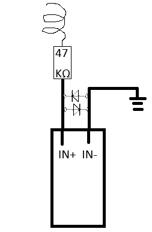

# ESP32 バイク/車用 多機能データロガー ＆ Android連携メーターアプリ

<p align="center">
  
</p>

本プロジェクトは、**ESP32**をベースとした高精度データロガー（タコメーター、GPS、SDカード保存、Bluetooth通信）のファームウェアと、それとリアルタイムに同期して走行情報を美しく可視化する**Android連携メーターアプリ（Kotlin/Jetpack Compose）**の統合システムです。

---

## 🌟 主な特徴

### 1. ESP32 ファームウェア (`ESP32_Logger`)
* **マルチコア (Dual-Core) 駆動**:
  * **Core 1 (計測・解析)**: 点火パルス信号の外部割り込み（GPIO 13）およびGPSシリアルデータ（HardwareSerial2）の受信と解析を極限まで低遅延で実行。
  * **Core 0 (通信・保存)**: スマホへのBluetoothデータ転送とMicroSDカードへのCSV記録を非同期で実行。計測処理のブロックを完全に防止。
* **10Hz (100ms周期) 超高速リアルタイム転送**:
  * 一般的な1Hz GPSの限界を超え、最新のRPM値とGPSキャッシュデータを掛け合わせ、**10Hz周期**でスマホにリアルタイム転送。
* **4点移動平均フィルタ (SMA)**:
  * パルスのチャタリング（ノイズ）やガタつきを抑制するため、パルス周期に対して直近4回分の移動平均フィルタをESP32側で適用し、表示のチラつきを滑らかに補正。
* **NMEA-0183 準拠チェックサム**:
  * データ破損を極小化するため、Bluetooth送信データ末尾にXOR演算によるチェックサムコードを付与。
* **スマホ同期型 A-GPS 高速測位 (NEW)**:
  * スマホとBluetooth接続した瞬間に、スマホ側の高精度GPS情報を利用してESP32経由でGPSモジュール（NEO-6M）のメモリへ「現在位置」と「現在時刻」を注入。
  * これにより、完全にオフライン（山奥などインターネット圏外）の環境であっても、通常数分以上かかるコールドスタート時間を**わずか十数秒〜数十秒へと劇的に短縮**。
* **MicroSDカード保護シールドロジック (NEW)**:
  * SDカードの未挿入時や初期化失敗時に `SD.open()` を呼び出してESP32が致命的クラッシュ（無限再起動）を起こす不具合を完全に防止。SDカードがない状態でもBluetoothメーター機能が100%安定して稼働し続ける堅牢設計。

### 2. Android メーターアプリ (`AndroidApp`)
* **Jetpack Compose によるプレミアムUI**:
  * ネオンブルーとグリーンを基調とした、視認性の極めて高いダークテーマデジタルメーター。
* **即座のRPM設定・再計算**:
  * アプリ設定画面から「2ストローク単気筒 (1.0 pulse/rev)」「4ストローク単気筒 (0.5 pulse/rev)」などの点火パルス設定を変更した際、**ESP32の再起動を必要とせずアプリ側で瞬時にRPMを再換算して表示へ反映**。
* **自動再接続 & ローカルCSVロギング**:
  * 接続が一時的に切断された場合でも、5秒周期で自動接続をリトライ。
  * 受信データをスマホの内部ストレージ（Scoped Storage対応、権限不要）へCSVとして追記ロギング可能。
* **最高速度の追跡・記録 ＆ ワンタップリセット**:
  * 走行中の最高速度（MAX SPEED）を自動で追跡・記録し、画面の中央メーターカードに美しく表示。設定画面からワンタップでいつでも記録をリセット可能。

---

## 🔌 ハードウェア仕様・ピンアサイン

拡張ボードのジャンパピンは **5V** に設定済みです。

| デバイス | ピン名 | ESP32 GPIO | 電源仕様 | 備考 |
| :--- | :--- | :--- | :--- | :--- |
| **タコメーター (PC817)** | OUT | **GPIO 13** | 独立 3.3V 給電 | 外部割り込み使用。5V混入防止のためVCCは3.3V固定（極めて重要）。入力段の保護回路を通過した安全なパルスをフォトカプラで検出。 |
| **GPS (NEO-6M)** | TX | **GPIO 16** | 5V 給電 | ESP32のRX2に接続 (HardwareSerial2) |
| | RX | **GPIO 17** | 5V 給電 | ESP32のTX2に接続 (HardwareSerial2) |
| **MicroSDカード** | MISO | **GPIO 19** | 5V 給電 | VSPIを使用。モジュール内レギュレータによる電圧降下防止のため5V必須。 |
| | MOSI | **GPIO 23** | | |
| | SCK | **GPIO 18** | | |
| | CS | **GPIO 5** | | |

> [!CAUTION]
> ### ⚠️ タコメーター入力段の物理破損（丸焦げ）防止について
> プラグコードに巻き付けた高回転時の誘導パルスは、数千〜数万ボルトの逆起電力や鋭いサージ高電圧を伴います。**これをフォトカプラ（PC817）の入力LEDへ直接入力すると、過電流と過電圧によってフォトカプラが瞬時に破損（丸焦げ）し、最悪の場合はESP32のGPIOピンまで破壊されます。**
> 
> 本システムでは物理破壊を防ぐため、PC817フォトカプラの一次側（入力LED端子）に以下の入力保護クランプ回路を挿入して安全にパルスを取り込んでいます。
> 
> <p align="center">
>   
> </p>
> 
> #### 🔧 保護回路の仕様と動作原理
> * **47kΩ サージ電流制限抵抗**: プラグコードの巻付けコイルから得られる数万ボルトの誘導パルスに対し、フォトカプラ（PC817）の入力LEDへ流れる電流を安全な数mAオーダーにまで低減します。
> * **双方向（逆並列）ダイオードクランプ**: `IN+` と `IN-` の間に2個のダイオードを双方向（互いに逆方向）に並列接続しています。
>   * これにより、正負両方向の過大な高電圧サージをダイオードの順方向電圧（約0.6V〜1V）にクランプし、フォトカプラ内部LEDの許容逆方向電圧（一般に6V程度）および最大順方向電流を超えるのを防ぎます。
> * **確実なグランド（アース）接続**: `IN-` 端子側および保護ダイオードのカソード・アノード共通端は、バイクや車両の**フレームグラウンド（アース）**にしっかりと接続し、ノイズや不要サージを大地/車体にバイパスします。
> 
> 自身で回路をブレッドボードや基板に実装する際は、フォトカプラLEDの物理的な焼損を防ぐため、必ずこの**「47kΩ抵抗 ＋ 双方向ダイオードクランプ ＋ アース接続」による入力保護回路**を構築した上でパルスラインを接続してください。

---

## 📊 通信データ仕様 (CSV & チェックサム)

Bluetooth Classic (SPP: Serial Port Profile) を介し、**10Hz (100ms)** 間隔で以下のフォーマットに従ってCSV文字列が送信されます。

### フォーマット:
```csv
[フィルタ済パルス周期(μs)],[速度(km/h)],[緯度],[経度],[UTC時刻]*[HEXチェックサム]\n
```

### 送信例:
```csv
150000,60.5,35.681234,139.767123,04:35:10*4A
```

* **パルス周期 (pulse_us)**: 点火パルス間の平均マイクロ秒（0の場合はエンジン停止中）。
* **チェックサム**: `*` より前のCSV文字列全体のXOR（排他的論理和）演算による2桁の16進数。Androidアプリ側でこれを用いてパケットの整合性を瞬時に検証。

### 📲 スマートフォン ➡️ ESP32 (A-GPSアシストデータ):
Bluetooth接続成功時に、スマホからESP32に向けて一度だけ以下のフォーマットで位置・時刻データが自動送信されます。
```csv
$AGPS,[緯度],[経度],[高度],[UTC日付],[UTC時刻]*[HEXチェックサム]\n
```
* **送信パラメータ**: 緯度経度は度表記（10進数）、高度はメートル、日付は `DDMMYY`、時刻は `HHMMSS.00`。
* **ESP32側の処理**: 受信後、XORチェックサムを検証した上で、標準NMEAの `$GPRMC` センテンスに動的変換してGPSモジュール（NEO-6M）へ直接流し込み、コールドスタートを高速化します。

---

## 💾 ログデータ（CSV）の保存タイミング ＆ 保存先

本システムは、**Androidスマートフォンのローカルストレージ**および**ESP32のMicroSDカード**の2箇所で同時にロギングを行っています。それぞれの保存タイミングと保存先パスは以下の通りです。

### 1. Androidアプリ側のログ（CSV）
Androidアプリの画面にある「CSV記録」スイッチをONにすることでロギングが開始されます。

* **保存タイミング**:
  * **記録中（リアルタイム）**: Bluetooth経由で10Hz（100ms周期）のデータを受信するたびに、バッファ付きライター（`bufferedWriter`）へデータが即座に追記（アペンド）されます.
  * **保存の確定（ディスク同期）**: アプリ画面で「接続切断」ボタンをタップした時、または「CSV記録」スイッチをOFFにしたタイミングでファイルが完全にクローズされ、ディスクストレージへの書き込みが確定します。
* **保存先フォルダーとパス**:
  * Android store の **Scoped Storage（アプリ専用外部ストレージ領域）** に保存されます。特別なストレージアクセス権限は不要です。
  * **パス**: `/Android/data/com.esp32logger/files/log_yyyyMMdd_HHmmss.csv`
    *(例: `log_20260528_145600.csv` のように記録開始時の日時タイムスタンプで新規ファイルが自動作成されます)*
  * ※アプリの「CSV記録」動作中は、保存先となる上記のファイル絶対パスが画面中央にリアルタイムで美しく表示されます。
* **保存フォーマット (人間に見やすく解析しやすいよう最適化)**:
  * Excelやスプレッドシート等でそのまま可視化・分析できるよう、**1行目に列名のヘッダーが存在**し、日本時間（JST）のタイムスタンプや、パルス周期から換算された**実際のRPM値（回転数）**が直接書き込まれます。チェックサムは含まれません。
  * **ヘッダー定義**: `JST時刻,raw_pulse_rpm,display_rpm,速度_kmh,緯度,経度,UTC時刻`
  * **データ例**: `2026/05/28 14:56:01,2000,4000,60.5,35.681234,139.767123,04:35:10`

### 2. ESP32側のログ（MicroSDカード）
ESP32本体にMicroSDカードが挿入されており、初期化に成功している場合に自動で記録されます。

* **保存タイミング**:
  * **1秒周期（1Hz）で一括書き込み**: 10Hz（100ms）ごとに細かく書き込むと、SDカードへのアクセスオーバーヘッドとカード寿命低下を招くため、**Core 0で10回分（1秒分）のデータをバッファリングし、1秒に1回まとめてSDカードに追記**しています。これにより、点火パルス割り込み処理などのメイン制御を一切ブロックせずに安全な保存を実現しています。
* **保存先ファイルパス**:
  * **パス**: MicroSDカードのルート直下にある `/log.txt`
* **保存フォーマット (生データ・超軽量フォーマット)**:
  * Bluetooth送信データと同一の**「ヘッダーなし・生パルス周期・チェックサム付き」**の超軽量・最小容量の生CSV形式で追記保存されます。
  * **データ構成**: `[フィルタ済パルス周期(μs)],[速度(km/h)],[緯度],[経度],[UTC時刻]*[HEXチェックサム]`
  * **データ例**: `150000,60.5,35.681234,139.767123,04:35:10*4A`

---

## 📂 ディレクトリ構成

```
ESP32-Tako-GPS/
├── app_icon.png                # アプリアイコン画像 (Readme埋め込み用)
├── input_circuit.png           # PC817入力保護クランプ回路図 (Readme埋め込み用)
├── SKILL.md                    # プロジェクト開発のコーディング規約・仕様書
├── README.md                   # 本書
├── ESP32_Logger/               # ESP32 ファームウェア
│   └── ESP32_Logger.ino        # Arduinoスケッチ本体 (C/C++)
└── AndroidApp/                 # Android 連携アプリケーション (Kotlin)
    ├── app/
    │   ├── src/main/
    │   │   ├── java/com/esp32logger/
    │   │   │   ├── MainActivity.kt           # エントリーポイント
    │   │   │   ├── MainScreen.kt             # Jetpack Compose UI (メーター・グラフ)
    │   │   │   ├── MainViewModel.kt          # UI状態管理・DataStore・CSV保存
    │   │   │   └── Esp32BluetoothManager.kt  # Bluetooth接続・自動再接続・NMEAパース
    │   │   └── AndroidManifest.xml           # パーミッションおよびアイコン設定
    │   └── build.gradle.kts
    └── build.gradle.kts
```

---

## 🛠️ セットアップ ＆ 導入方法

### ① ESP32 側
1. **必要ライブラリのインストール**:
   * Arduino IDEのライブラリマネージャーから `TinyGPS++` をインストール。
2. **書き込み**:
   * `ESP32_Logger/ESP32_Logger.ino` を開き、ボードに「ESP32 Dev Module」を選択して書き込みます。
   * 起動すると、Bluetoothのペアリング名 `ESP32_Logger` としてアドバタイズが開始されます。

> [!IMPORTANT]
> **Bluetoothペアリング時のPINコードは `1234` です。**
> スマホでペアリング要求ダイアログが表示されたら、**1234** を入力して「ペアリング」をタップしてください。
> 旧バージョンを使用していた場合は、スマホのBluetooth設定で `ESP32_Logger` を一度削除してから再ペアリングしてください。

### ② Android 側
1. **開発環境**:
   * **Android Studio** (JDK 17以上推奨)
   * エミュレータまたは実機でデバッグビルドを実行可能。
2. **ビルド**:
   ```bash
   cd AndroidApp
   ./gradlew assembleDebug
   ```
   * 生成された `app/build/outputs/apk/debug/app-debug.apk` を端末にインストールします。
3. **初期設定**:
   * スマホのBluetooth設定画面から、事前に `ESP32_Logger` とペアリングを完了させてください。
   * アプリを起動し、Bluetooth接続許可を与え、「ESP32_Loggerに接続」をタップすればリアルタイム計測が開始されます。
   * メーターの右上にあるギアマーク（設定）から、エンジン形式に合わせて `pulsePerRevolution` を選択またはカスタム入力してください。

---

## 📝 開発規約・保守ガイドライン

開発における追加機能やトラブルシューティング、物理的な保護設計などの詳細仕様については、リポジトリに含まれる [SKILL.md](SKILL.md) を必ずご参照ください。

---

## 📋 更新履歴

### v1.3.0 — 2026-05-29 セキュリティ強化

| 対象 | 内容 |
| :--- | :--- |
| 🔴 ESP32 | **Bluetooth PINコード設定**: `setPin("1234")` を追加。無認証接続・コマンドインジェクション攻撃を防止。 |
| 🔴 ESP32 | **BTバッファ行頭フィルタ強化**: `$` 始まり以外のデータを即破棄。悪意ある分割パケット注入（パーシャルライト攻撃）を防止。 |
| 🟡 Android | **バックアップ無効化**: `allowBackup=false` に変更。`adb backup` コマンドによる位置情報・ログデータの平文漏洩を防止。 |
| 🟡 Android | **古い位置情報フィルタ**: 30分以上前のキャッシュ位置は使用しないよう変更。古いデータでのGPSアシストによる測位悪化・プライバシー問題を防止。 |
| 🟡 Android | **権限事前チェック追加**: `@SuppressLint` 依存を排除し、位置情報アクセス前に `checkSelfPermission` で明示的に確認するよう変更。 |

### v1.2.0 — 2026-05-29 バグ修正

| 対象 | 内容 |
| :--- | :--- |
| 🔴 ESP32 | **A-GPS注入コマンドを修正**: 仕様違反だった `$PUBX,40` / `$PUBX,41`（設定コマンド）を廃止し、標準NMEA の `$GPRMC` センテンスでNEO-6Mへ正しく注入するよう修正。これにより A-GPS が初めて実際に機能するようになりました。 |
| 🔴 ESP32 | **SDカード書き込みモード修正**: `FILE_WRITE`（毎回上書き）を `FILE_APPEND`（追記）に修正。以前のバージョンではデータが蓄積されずに消え続けていました。 |
| 🟡 ESP32 | **ミューテックス失敗時のデータ競合修正**: ミューテックス未取得のままコア間共有データを読むバグを修正。安全なフォールバック変数で対応。 |
| 🟡 Android | **再接続の無限再帰を修正**: `connectInternal()` の再帰呼び出しを `while` ループに変換し、長時間切断時のスタックオーバーフローリスクを排除。 |
| 🟡 Android | **権限要求の改善**: 接続ボタン押下時に権限付与済みか先にチェックし、付与済みなら直接 `connect()` を呼ぶよう変更。不要なダイアログ表示を排除。 |
| 🟡 Android | **不要な `BLUETOOTH_SCAN` 権限を削除**: ペアリング済みデバイスへのSPP接続には `BLUETOOTH_CONNECT` のみで十分。 |

### v1.1.0 — スマホ同期型 A-GPS 実装
* スマートフォンのGPS情報をBluetoothでESP32に同期し、NEO-6Mのコールドスタートを劇的に短縮。
* SDカード未挿入時の起動クラッシュ（無限再起動）を防止する保護ロジックを追加。

### v1.0.0 — 初回リリース
* デュアルコア駆動の10Hz超高速Bluetoothリアルタイムメーター。
* GPS速度・RPM・座標・UTC時刻・4点移動平均フィルタ・自動再接続を実装。

---

## 🪪 ライセンス

本プロジェクトはMITライセンスのもとで公開されています。商用・個人利用問わず自由に変更・配布可能です。
