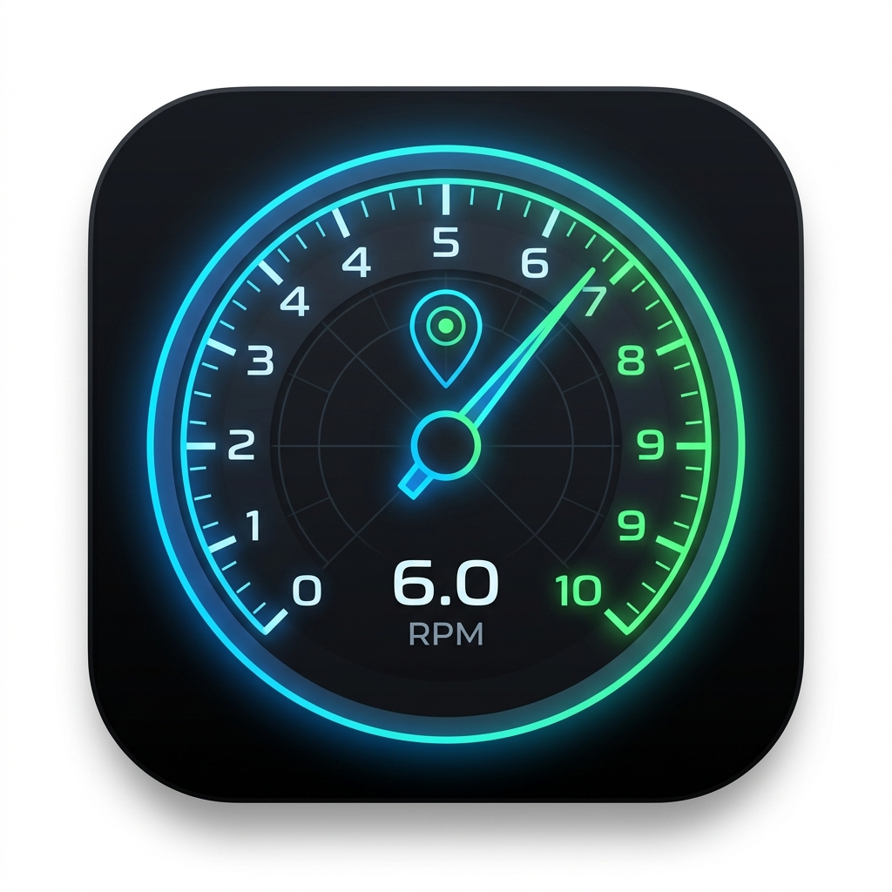

# ESP32 バイク/車用 多機能データロガー ＆ Android連携メーターアプリ

<p align="center">
  
</p>

本プロジェクトは、**ESP32**をベースとした高精度データロガー（タコメーター、GPS、SDカード保存、Bluetooth通信）のファームウェアと、それとリアルタイムに同期して走行情報を美しく可視化する**Android連携メーターアプリ（Kotlin/Jetpack Compose）**の統合システムです。

---

## 🌟 主な特徴

### 1. ESP32 ファームウェア (`ESP32_Logger`)
* **マルチコア (Dual-Core) 駆動**:
  * **Core 1 (計測・解析)**: 点火パルス信号の外部割り込み（GPIO 13）およびGPSシリアルデータ（HardwareSerial2）の受信と解析を極限まで低遅延で実行。
  * **Core 0 (通信・保存)**: スマホへのBluetoothデータ転送とMicroSDカードへのCSV記録を非同期で実行。計測処理のブロックを完全に防止。
* **10Hz (100ms周期) 超高速リアルタイム転送**:
  * 一般的な1Hz GPSの限界を超え、最新のRPM値とGPSキャッシュデータを掛け合わせ、**10Hz周期**でスマホにリアルタイム転送。
* **4点移動平均フィルタ (SMA)**:
  * パルスのチャタリング（ノイズ）やガタつきを抑制するため、パルス周期に対して直近4回分の移動平均フィルタをESP32側で適用し、表示のチラつきを滑らかに補正。
* **NMEA-0183 準拠チェックサム**:
  * データ破損を極小化するため、Bluetooth送信データ末尾にXOR演算によるチェックサムコードを付与。

### 2. Android メーターアプリ (`AndroidApp`)
* **Jetpack Compose によるプレミアムUI**:
  * ネオンブルーとグリーンを基調とした、視認性の極めて高いダークテーマデジタルメーター。
* **即座のRPM設定・再計算**:
  * アプリ設定画面から「2ストローク単気筒 (1.0 pulse/rev)」「4ストローク単気筒 (0.5 pulse/rev)」などの点火パルス設定を変更した際、**ESP32の再起動を必要とせずアプリ側で瞬時にRPMを再換算して表示へ反映**。
* **自動再接続 & ローカルCSVロギング**:
  * 接続が一時的に切断された場合でも、5秒周期で自動接続をリトライ。
  * 受信データをスマホの内部ストレージ（Scoped Storage対応、権限不要）へCSVとして追記ロギング可能。
* **最高速度の追跡・記録 ＆ ワンタップリセット**:
  * 走行中の最高速度（MAX SPEED）を自動で追跡・記録し、画面の中央メーターカードに美しく表示。設定画面からワンタップでいつでも記録をリセット可能。

---

## 🔌 ハードウェア仕様・ピンアサイン

拡張ボードのジャンパピンは **5V** に設定済みです。

| デバイス | ピン名 | ESP32 GPIO | 電源仕様 | 備考 |
| :--- | :--- | :--- | :--- | :--- |
| **タコメーター (PC817)** | OUT | **GPIO 13** | 独立 3.3V 給電 | 外部割り込み使用。5V混入防止のためVCCは3.3V固定（極めて重要）。プラグコードに巻きつけた誘導パルスをフォトカプラで安全に検出。 |
| **GPS (NEO-6M)** | TX | **GPIO 16** | 5V 給電 | ESP32のRX2に接続 (HardwareSerial2) |
| | RX | **GPIO 17** | 5V 給電 | ESP32のTX2に接続 (HardwareSerial2) |
| **MicroSDカード** | MISO | **GPIO 19** | 5V 給電 | VSPIを使用。モジュール内レギュレータによる電圧降下防止のため5V必須。 |
| | MOSI | **GPIO 23** | | |
| | SCK | **GPIO 18** | | |
| | CS | **GPIO 5** | | |

---

## 📊 通信データ仕様 (CSV & チェックサム)

Bluetooth Classic (SPP: Serial Port Profile) を介し、**10Hz (100ms)** 間隔で以下のフォーマットに従ってCSV文字列が送信されます。

### フォーマット:
```csv
[フィルタ済パルス周期(μs)],[速度(km/h)],[緯度],[経度],[UTC時刻]*[HEXチェックサム]\n
```

### 送信例:
```csv
150000,60.5,35.681234,139.767123,04:35:10*4A
```

* **パルス周期 (pulse_us)**: 点火パルス間の平均マイクロ秒（0の場合はエンジン停止中）。
* **チェックサム**: `*` より前のCSV文字列全体のXOR（排他的論理和）演算による2桁の16進数。Androidアプリ側でこれを用いてパケットの整合性を瞬時に検証。

---

## 📂 ディレクトリ構成

```
ESP32-Tako-GPS/
├── app_icon.png                # アプリアイコン画像 (Readme埋め込み用)
├── SKILL.md                    # プロジェクト開発のコーディング規約・仕様書
├── README.md                   # 本書
├── ESP32_Logger/               # ESP32 ファームウェア
│   └── ESP32_Logger.ino        # Arduinoスケッチ本体 (C/C++)
└── AndroidApp/                 # Android 連携アプリケーション (Kotlin)
    ├── app/
    │   ├── src/main/
    │   │   ├── java/com/esp32logger/
    │   │   │   ├── MainActivity.kt           # エントリーポイント
    │   │   │   ├── MainScreen.kt             # Jetpack Compose UI (メーター・グラフ)
    │   │   │   ├── MainViewModel.kt          # UI状態管理・DataStore・CSV保存
    │   │   │   └── Esp32BluetoothManager.kt  # Bluetooth接続・自動再接続・NMEAパース
    │   │   └── AndroidManifest.xml           # パーミッションおよびアイコン設定
    │   └── build.gradle.kts
    └── build.gradle.kts
```

---

## 🛠️ セットアップ ＆ 導入方法

### ① ESP32 側
1. **必要ライブラリのインストール**:
   * Arduino IDEのライブラリマネージャーから `TinyGPS++` をインストール。
2. **書き込み**:
   * `ESP32_Logger/ESP32_Logger.ino` を開き、ボードに「ESP32 Dev Module」を選択して書き込みます。
   * 起動すると、Bluetoothのペアリング名 `ESP32_Logger` としてアドバタイズが開始されます。

### ② Android 側
1. **開発環境**:
   * **Android Studio** (JDK 17以上推奨)
   * エミュレータまたは実機でデバッグビルドを実行可能。
2. **ビルド**:
   ```bash
   cd AndroidApp
   ./gradlew assembleDebug
   ```
   * 生成された `app/build/outputs/apk/debug/app-debug.apk` を端末にインストールします。
3. **初期設定**:
   * スマホのBluetooth設定画面から、事前に `ESP32_Logger` とペアリングを完了させてください。
   * アプリを起動し、Bluetooth接続許可を与え、「ESP32_Loggerに接続」をタップすればリアルタイム計測が開始されます。
   * メーターの右上にあるギアマーク（設定）から、エンジン形式に合わせて `pulsePerRevolution` を選択またはカスタム入力してください。

---

## 📝 開発規約・保守ガイドライン

開発における追加機能やトラブルシューティング、物理的な保護設計などの詳細仕様については、リポジトリに含まれる [SKILL.md](SKILL.md) を必ずご参照ください。

---

## 🪪 ライセンス

本プロジェクトはMITライセンスのもとで公開されています。商用・個人利用問わず自由に変更・配布可能です。
